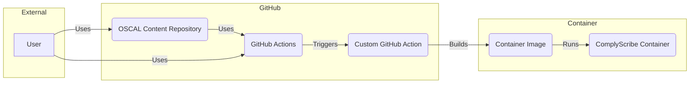
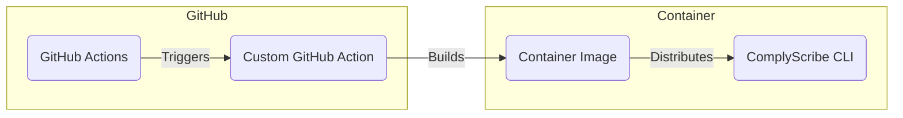
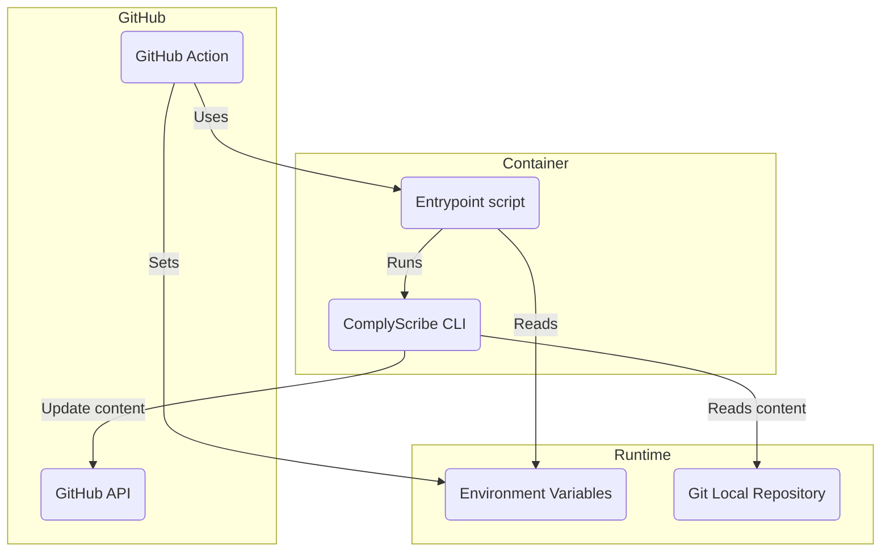

## Context

```mermaid
graph LR
  subgraph External
    User
  end

  subgraph Container
    ContainerImage("Container Image")
    ComplyScribeContainer("ComplyScribe Container")
  end

  subgraph GitHub
    OSCALRepo("OSCAL Content Repository")
    GithubActions("GitHub Actions")
    CustomAction("Custom GitHub Action")
  end

  User -- Uses --> OSCALRepo
  GithubActions -- Triggers --> CustomAction
  CustomAction -- Builds --> ContainerImage
  ContainerImage -- Runs --> ComplyScribeContainer
  OSCALRepo -- Uses --> GithubActions
  User -- Uses --> GithubActions
```

## Container

```mermaid
graph LR
  subgraph Container
    ContainerImage("Container Image")
    ComplyScribeCLI("ComplyScribe CLI")
  end
  subgraph GitHub
    GithubActions("GitHub Actions")
    CustomAction("Custom GitHub Action")
  end


  GithubActions -- Triggers --> CustomAction
  CustomAction -- Builds --> ContainerImage
  ContainerImage -- Distributes --> ComplyScribeCLI
```

## Component

```mermaid
graph TD
  subgraph Container
    ComplyScribeCLI("ComplyScribe CLI")
    Entrypoint("Entrypoint script")
  end

  subgraph Runtime
    EnvironmentVariables("Environment Variables")
    GitRepo("Git Local Repository")
  end

  subgraph GitHub
    GitHubAction("GitHub Action")
    GitHubAPI("GitHub API")
  end

  GitHubAction -- Sets --> EnvironmentVariables
  GitHubAction -- Uses --> Entrypoint
  ComplyScribeCLI -- Reads content --> GitRepo
  Entrypoint -- Runs --> ComplyScribeCLI
  Entrypoint -- Reads --> EnvironmentVariables
  ComplyScribeCLI -- Update content --> GitHubAPI
```
