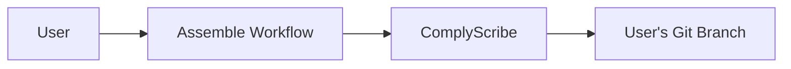
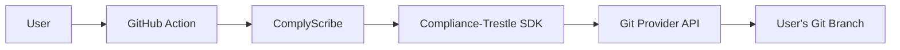

# Diagrams: Assemble

## Context

```mermaid
graph LR
    User["User"] --> Assemble_Workflow["Assemble Workflow"]
    Assemble_Workflow --> ComplyScribe["ComplyScribe"]
    ComplyScribe --> Branch["User's Git Branch"]
```

## Container

```mermaid
graph LR
    User["User"] --> GH_Action["GitHub Action"]
    GH_Action --> ComplyScribe["ComplyScribe"]
    ComplyScribe --> Compliance_Trestle["Compliance-Trestle SDK"]
    Compliance_Trestle --> Git_Provider_API["Git Provider API"]
    Git_Provider_API --> Branch["User's Git Branch"]
```