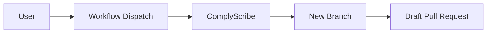
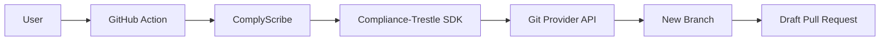

# Diagrams: Create Content

## Context

```mermaid
graph LR
    User["User"] --> Workflow_Dispatch["Workflow Dispatch"]
    Workflow_Dispatch --> ComplyScribe["ComplyScribe"]
    ComplyScribe --> New_Branch["New Branch"]
    New_Branch --> PR["Draft Pull Request"]

```

## Container

```mermaid
graph LR
    User["User"] --> GH_Action["GitHub Action"]
    GH_Action --> ComplyScribe["ComplyScribe"]
    ComplyScribe --> Compliance_Trestle["Compliance-Trestle SDK"]
    Compliance_Trestle --> Git_Provider_API["Git Provider API"]
    Git_Provider_API --> Branch["New Branch"]
    Branch --> PR["Draft Pull Request"]
```